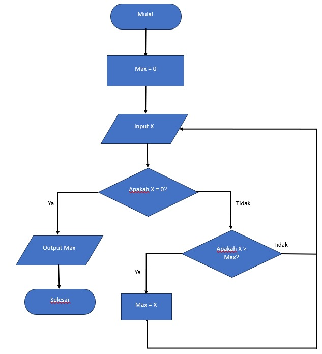
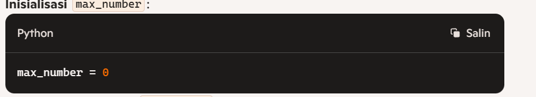
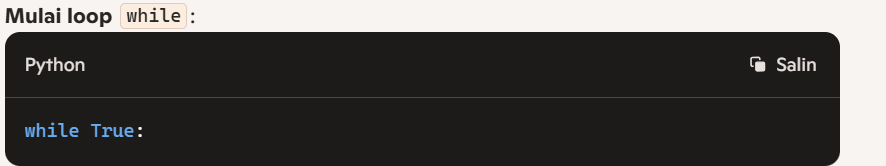
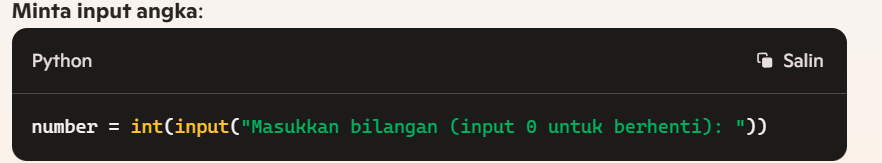
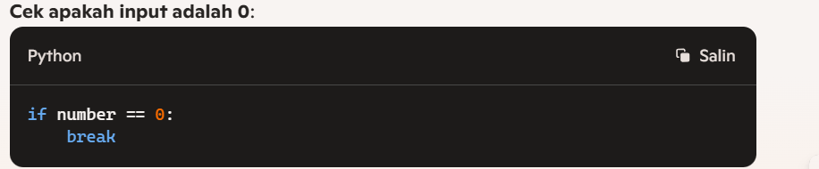
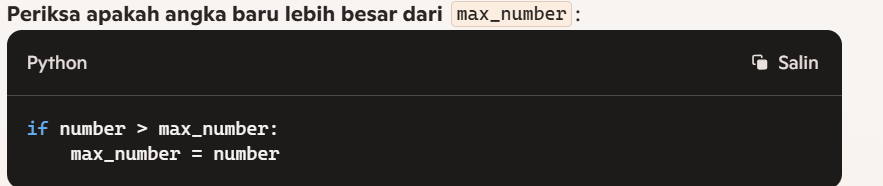
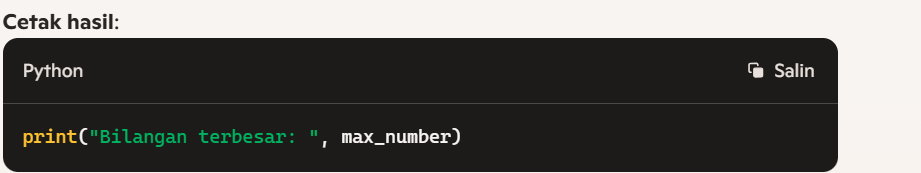
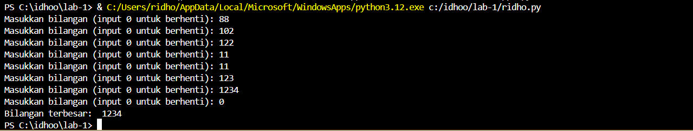

# lab1

# praktikum3

# menentukan  bilangan terbesar 

# membuat flowchart
1.Mulai (Start): Di sinilah proses dimulai, titik awal dari seluruh algoritma.

2.Max = 0: Inisialisasi variabel Max ke 0. Ini berarti, sebelum memulai, kita asumsikan bahwa nilai maksimum adalah 0.

3.Input X: Meminta pengguna untuk memasukkan angka X.

4.Apakah X = 0?: Mengecek apakah nilai X adalah 0.
-Jika Ya (Yes), ini berarti tidak ada lagi angka yang akan dimasukkan, dan kita lanjut ke langkah 5.
-Jika Tidak (No), kita lanjut ke langkah 7 untuk mengecek apakah X lebih besar dari Max.

5.Output Max: Jika X adalah 0, kita keluarkan nilai Max sebagai hasil akhir, karena ini berarti kita sudah selesai memasukkan semua angka.

6.Selesai (End): Proses selesai. Tidak ada lagi angka yang diproses.

7.Apakah X > Max?: Jika X bukan 0, kita cek apakah X lebih besar dari Max.
-Jika Ya (Yes), ini berarti kita menemukan angka yang lebih besar dari nilai maksimum saat ini. Maka, Max di-update dengan nilai X.
-Jika Tidak (No), kita abaikan X dan tetap dengan nilai Max saat ini.

8.Kembali ke Input X: Setelah memperbarui Max atau mengecek X, kita kembali ke langkah 3 untuk memasukkan angka berikutnya.

Dengan cara ini, algoritma akan terus meminta pengguna untuk memasukkan angka sampai pengguna memasukkan 0. Pada saat itu, algoritma akan mengeluarkan nilai maksimum yang ditemukan selama proses input.

ini lah gambar flowchart nya

# membuat flowchat dengan python

1. Inisialisasi max_number:

Ini mengatur nilai awal max_number ke 0, yang berarti kita mulai tanpa angka maksimum yang ditentukan.

2.Mulai loop while:

Ini memulai loop yang akan terus berulang sampai kondisi break terpenuhi.

3.Minta input angka:

Program meminta pengguna untuk memasukkan angka. Jika pengguna memasukkan 0, loop akan berhenti.

4.Cek apakah input adalah 0:

Jika angka yang dimasukkan adalah 0, perintah break akan menghentikan loop

5.Periksa apakah angka baru lebih besar dari max_number:

Jika angka yang dimasukkan lebih besar dari max_number saat ini, maka max_number diperbarui dengan angka yang baru saja dimasukkan.

6.Cetak hasil:

Setelah loop selesai (karena pengguna memasukkan 0), program mencetak nilai max_number, yang merupakan angka terbesar yang diinputkan oleh pengguna.

Ini adalah gambar hasil dari pyhton yang sudah dimasukan bilangan

